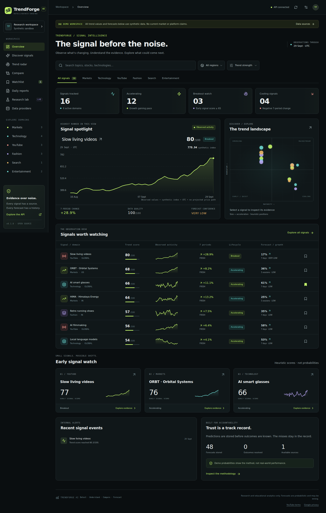
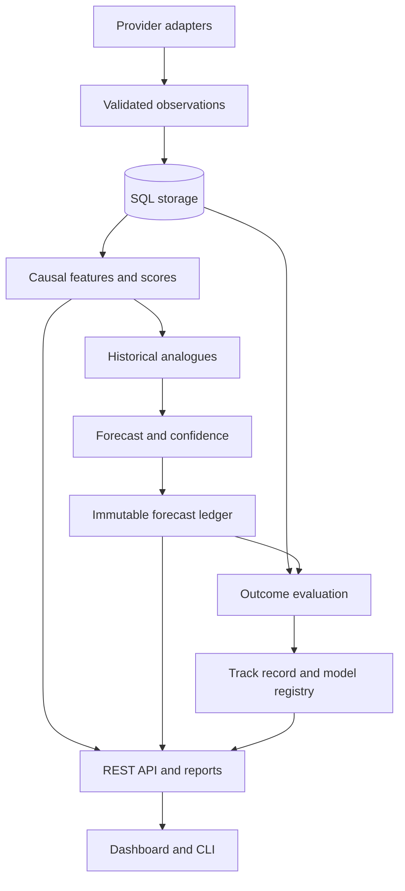
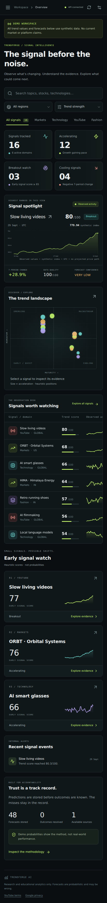

# TrendForge AI

**Universal Trend Intelligence & Forecasting Engine**

**Detect · Understand · Compare · Forecast**

TrendForge turns timestamped observations into inspectable trend signals, searches for historical analogues, and records probabilistic forecasts before their outcomes are known. It is a working, modular **v0.1 research MVP**, with an experimental model lab—not a validated investment system or a claim to have implemented every item in the long-term roadmap.



The interface uses a dark intelligence-workspace design, mobile navigation, keyboard-accessible controls, provenance tables, freshness labels, and a persistent watchlist. All pictured values are synthetic.

## Run the demo

Requirements: Python **3.12+**, Node **22.12+**, npm. Run backend commands from the repository root.

```bash
python -m venv .venv
# Linux / macOS / WSL:
source .venv/bin/activate
# Windows PowerShell instead: .venv\Scripts\Activate.ps1

python -m pip install -r backend/requirements.lock
python -m pip install --no-deps -e backend
python -m trendforge demo
python -m trendforge serve
```

In a second terminal:

```bash
cd frontend
npm ci
npm run dev
```

Open **http://localhost:5173**. API: **http://127.0.0.1:8000**. Interactive API docs: **http://127.0.0.1:8000/docs**.

The demo command creates the database through Alembic migrations, generates deterministic daily observations from 2025-01-01 to the last completed UTC day, calculates scores, stores forecasts and writes reports. It is safe to rerun: duplicate observations and unchanged score snapshots are skipped. It never calls a paid API. No real stock prices or current platform statistics are fabricated; demo stocks have fictional names and symbols.

## Docker

```bash
docker compose up --build
```

Open **http://localhost:8080**. SQLite and report volumes persist between starts. The default deployment binds to localhost, uses non-root application containers, a read-only root filesystem, dropped capabilities and no-new-privileges. Docker Compose 2.24+ is required for optional `.env` loading. Stopping containers preserves data; do not use `down -v` unless you intend to remove the volumes.

Optional PostgreSQL deployment:

```bash
# Set a strong POSTGRES_PASSWORD in .env first; avoid URL-reserved characters.
docker compose -f docker-compose.yml -f compose.postgres.yml up --build
```

See [deployment and scheduling](docs/deployment.md) for persistent scheduling, authentication, backup, and live-provider restrictions. Docker runtime verification status is recorded in the [audit](docs/verification.md).

## What is implemented

| Area | v0.1 behavior | Status |
|---|---|---|
| Storage | SQLite default, SQLAlchemy models, Alembic migrations, PostgreSQL configuration | Working SQLite; PostgreSQL requires deployment verification |
| Providers | Normalized adapter interface, bounded retries, allowlisted HTTPS, quotas, timestamps, caching, failure isolation | Working; external adapters tested with mock responses |
| Demo | Six domains, deterministic synthetic daily series, fictional financial assets | MOCK/DEMO |
| Finance | Alpha Vantage `TIME_SERIES_DAILY`, OHLCV, date/timezone normalization | OPTIONAL; API key and plan required |
| GitHub | Public repository stars, forks, issues; daily snapshots and age-normalized summary | OPTIONAL; history accumulates after configuration |
| YouTube | Official API raw public-video statistics with expiry and derived-analysis restrictions | OPTIONAL; key required; raw-only |
| Trend analysis | Causal smoothing, momentum, elapsed-time derivatives, robust anomaly scores, configurable domain weights, lifecycle and early-signal indices | Working heuristics |
| Analogues | Euclidean, cosine, correlation and constrained DTW; disjoint windows and outcome embargo | Working research engine |
| Forecasts | Multi-horizon, three exclusive direction classes, probability smoothing, conservative confidence, OOD flag | EXPERIMENTAL; unvalidated live calibration |
| Audit | Frozen inputs, feature/config hashes, model version, separate outcomes, database append-only triggers | Working |
| Dashboard | Discovery, search, detail, forecasts/history, raw evidence, radar, heatmap, comparisons, watchlist, reports and provider status | Working |
| Research | Walk-forward evaluation, reliability diagrams, lead–lag explorer; offline logistic/RF/gradient-boosting comparison | EXPERIMENTAL |
| Governance | Versioned baseline card, appended evaluation runs, conservative promotion eligibility gate | Working; no automatic promotion |
| Operations | CLI, structured update summaries, health/metrics, daily reports, state-preserving GitHub schedules, CI/security workflows | Implemented; activate after publishing/configuring GitHub |

**Not configured / roadmap:** live Google Trends, live fashion/news/retail signals, semantic embeddings, LLM explanations, geography interest maps, multi-user accounts, deep models, Neo4j, push notification integrations, broker orders and PWA offline caches. No buttons pretend these integrations work. The model lab includes calibration utilities, but unvalidated probabilities are never relabeled as calibrated.

## Architecture



Provider data, derived analysis, inference and forecasts stay distinct. Analytics never convert a successful HTTP request into a claim of fresh source data. [Detailed architecture](ARCHITECTURE.md).

## Live provider setup

Copy `.env.example` to `.env`, set `DEMO_MODE=false`, generate a server access token, and configure the sources you can access:

```bash
python -c "import secrets; print(secrets.token_urlsafe(32))"
```

```dotenv
DEMO_MODE=false
API_TOKEN=replace-with-your-generated-workspace-token
ALPHA_VANTAGE_API_KEY=
FINANCE_SYMBOLS=IBM
GITHUB_REPOS=owner/repository
GITHUB_TOKEN=
YOUTUBE_API_KEY=
YOUTUBE_VIDEO_IDS=
```

```bash
trendforge update
trendforge providers
trendforge serve
```

Enter only the **workspace access token** in the dashboard connection dialog. Provider secrets stay in the backend. Never use an API key as your workspace token. Provider health remains `NOT CONFIGURED` until required settings exist; an inaccessible source does not trigger a hidden scrape or a fake fallback. Switching modes filters the database by provenance: demo observations are never blended into live forecasts.

GitHub and YouTube API snapshots do not supply a historical daily series. Sparse data stays sparse, and insufficient history produces no forecast. Alpha Vantage's compact daily history may also be insufficient for enough independent analogues at a long horizon. See [provider capabilities and policies](docs/providers.md).

## CLI

```bash
trendforge doctor
trendforge search "smart glasses"
trendforge trend "cherry red"
trendforge stock ORBT
trendforge emerging
trendforge providers
trendforge update
trendforge report
trendforge track-record
trendforge evaluate demo:smart-glasses --horizon 7
trendforge evaluate demo:orbital --horizon 5 --ensemble
trendforge verify-audit FORECAST_ID
```

`python -m trendforge` exposes the same commands. `update` honors a 24-hour provider cache; `--force` bypasses that local cache, not external quotas. The UI reload button only reloads stored results—it does not secretly spend API quota. Search examines configured canonical entities; it does not promise arbitrary-web coverage.

## Forecasting and validation

The enabled baseline normalizes the current 21-observation log-price/activity pattern, retrieves sufficiently similar older windows, excludes overlapping pattern/outcome intervals, and counts their subsequent growth/sideways/decline outcomes. A symmetric one-per-class prior smooths frequencies. Sideways thresholds scale with known historical volatility, with a 1% floor. All three probabilities sum to one.

Historical analogues and their outcomes must end before the current query window. Every walk-forward origin computes from a data prefix; test horizons do not overlap. ML research folds purge all training labels whose outcomes are not known before validation. Preprocessing is fitted within each fold. **No random train/test split is used.**

The initial baseline is intentionally capped at `LOW` confidence. Synthetic examples have no real-world predictive validity. Retrospective replay is separate from the prospective forecast ledger. Read [forecasting](docs/forecasting.md), [evaluation](docs/model-evaluation.md) and the [baseline model card](models/analogue-dirichlet-v1.md).

## Tests and checks

```bash
python -m pip install -r backend/requirements-dev.lock
cd backend
ruff check trendforge tests
ruff format --check trendforge tests
mypy --config-file pyproject.toml trendforge
pytest -q
cd ../frontend
npm ci
npm run lint
npm run typecheck
npm run build
npx playwright install --with-deps chromium
npm run test:e2e
cd ..
python scripts/verify_repository.py
docker compose config --quiet
```

Seed the demo before browser tests. Use a test database for development when you do not want browser tests to change the workspace watchlist. The checked-in test suite covers mock provider failures, duplicates, timestamps, snapshots, leakage, audit immutability, confidence, calibration, API authorization, reports and real browser workflows. Read the [verification report](docs/verification.md) for results and remaining environmental limits.

## Mobile and cross-platform

The dashboard treats Android as a primary viewport: sticky navigation, touch controls, horizontal table scrolling, compact cards, and a slide-out navigation panel. The API and database remain on the machine running the backend.



See [Windows/Linux/macOS/WSL/Android/Codespaces setup](docs/getting-started.md). Scientific Python wheels can be difficult on Android; a Debian/Ubuntu proot environment or a remote backend is the practical route. A direct Termux installation is not claimed as tested.

## Documentation

- [Getting started](docs/getting-started.md)
- [Provider architecture and policies](docs/providers.md)
- [REST API](docs/api.md)
- [Trend engine and scoring assumptions](docs/trend-engine.md)
- [Stock analytics](docs/stock-analysis.md)
- [Model evaluation and governance](docs/model-evaluation.md)
- [Adding a domain or provider plugin](docs/adding-a-domain.md)
- [Deployment, daily schedules and backups](docs/deployment.md)
- [Roadmap](ROADMAP.md), [contributing](CONTRIBUTING.md), [security](SECURITY.md)

## License and data rights

The code uses the [MIT License](LICENSE) for simple, permissive reuse and community integration. The license covers this repository's code and synthetic datasets; it does **not** relicense provider data. API terms, access permissions and redistribution rights remain separate.

## Disclaimer

TrendForge provides statistical, historical and informational analysis. Forecasts are probabilistic estimates derived from available data and models and may be incorrect. Financial-market information is provided for research and educational purposes and is not personalized investment advice.

No broker execution, profit guarantee, private-account scraping, personal tracking or identity profiling is included. More detail: [DISCLAIMER.md](DISCLAIMER.md).
